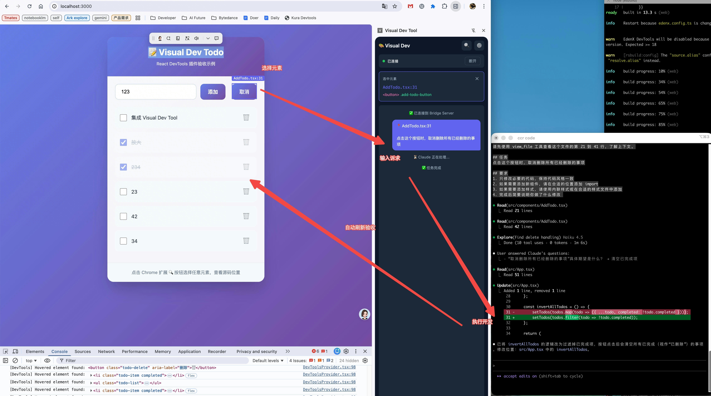

# Visual Dev Tool

一个可视化开发工具，让开发者在浏览器中点击 React 元素，通过侧边栏对话描述需求，由 Claude Code CLI 自动执行代码修改。

## 核心特性

- 🎯 **零配置源码定位**：利用 React Fiber 自动识别源码位置，无需在业务代码中插入冗余属性。
- 📂 **多项目状态隔离**：自动识别项目路径，并按项目持久化保存对话历史和选中的元素。
- ⌨️ **便捷快捷键**：通过 `Cmd + Shift + S` (Mac) 或 `Ctrl + Shift + S` (Windows/Linux) 快速进入元素选择模式。
- 🚀 **智能侧边栏**：侧边栏仅在 `localhost` 开发环境下生效，切换 Tab 时自动恢复或隐藏，确保不干扰日常办公。
- 🛠 **iTerm2 深度适配**：自动在 iTerm2 中启动 Claude Code 会话，提供沉浸式的 AI 结对编程体验。

## 示例


## 本地快速开始

### 1. 安装依赖

```bash
pnpm install
```

### 2. 构建所有包

```bash
pnpm build
```

### 3. 启动 Bridge Server

```bash
# 构建并运行
pnpm --filter @visual-dev/bridge-server build
node packages/bridge-server/bin/vdev-server.js
```

### 4. 在你的 React 项目中集成

只需安装 SDK 并在 App 中引入 Provider 即可。

```bash
# 在你的 React 项目中
npm install /path/to/visual-dev-tool/packages/react-devtools
```

```tsx
// App.tsx
import { DevToolsProvider } from '@visual-dev/react-devtools';

function App() {
  return (
    <DevToolsProvider enabled={process.env.NODE_ENV === 'development'}>
      <YourApp />
    </DevToolsProvider>
  );
}
```

### 5. 安装 Chrome 扩展

1. 打开 Chrome，访问 `chrome://extensions/`
2. 开启「开发者模式」
3. 点击「加载已解压的扩展程序」
4. 选择 `packages/extension/dist` 目录

### 6. 配置 Claude Code CLI

确保你的系统已正确配置 Claude Code CLI：
司内参考：https://bytedance.larkoffice.com/docx/Sh6RddSBhovG1IxQjCcc0MHpnph?from=from_parent_docx

### 7. 开始使用

1. 启动你的 React 开发服务器
2. 启动 Bridge Server
3. 打开 Chrome 访问 localhost
4. 点击扩展图标打开侧边栏（会自动识别项目路径并恢复历史状态）
5. 点击 🔍 按钮或使用快捷键 `Cmd + Shift + S` 选择页面元素
6. 在聊天框中描述你的修改需求

## 包结构

- `@visual-dev/react-devtools` - React SDK (运行时定位)
- `@visual-dev/bridge-server` - WebSocket 服务器 (连接浏览器和 Claude CLI)
- `visual-dev-extension` - Chrome 扩展 (侧边栏 UI)

## License

Bruce Too
