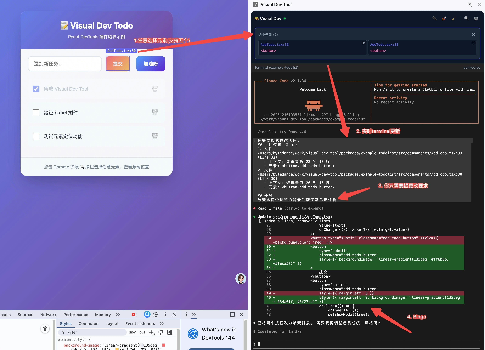

# Visual Agentic Dev

An immersive browser development environment that allows developers to click on React elements in the browser, describe requirements via a sidebar chat, and have Claude Code CLI automatically execute code modifications.

## Core Features

- 🎯 **Zero-Config Source Location**: Utilizes React Fiber to automatically identify source code locations without inserting redundant attributes into business code.
- 📂 **Multi-Project Parallel Development**: Automatically identifies the project belonging to the current Tab and intelligently switches to the corresponding terminal session, supporting simultaneous development of multiple micro-frontend applications.
- 🖱️ **Batch Element Modification**: Supports selecting multiple page elements and sending them to Claude Code for batch modification in one go.
- ⌨️ **Convenient Shortcuts**: Quickly enter element selection mode via `Cmd + Shift + S` (Mac) or `Ctrl + Shift + S` (Windows/Linux).
- 🚀 **Smart Sidebar**: Sidebar state is bound to the project; switching Tabs automatically restores the context and terminal history for that project.
- 🛠 **Built-in Terminal Integration**: Run Claude Code directly in the sidebar without frequent window switching, providing an immersive AI pair programming experience.

## Demo


## Quick Start (Local)

### 1. Install Dependencies

```bash
pnpm install
```

### 2. Build All Packages

```bash
pnpm build
```

### 3. Start Bridge Server

```bash
# Build and run
pnpm --filter @visual-dev/bridge-server build
node packages/bridge-server/bin/vdev-server.js
```

### 4. Integrate into Your React Project

Simply install the SDK and introduce the Provider in your App.

```bash
# In your React project
npm install /path/to/visual-dev-tool/packages/react-devtools
```

```tsx
// App.tsx
import { DevToolsProvider } from '@visual-dev/react-devtools';

function App() {
  return (
    <DevToolsProvider enabled={process.env.NODE_ENV === 'development'}>
      <YourApp />
    </DevToolsProvider>
  );
}
```

### 5. Install Chrome Extension

1. Open Chrome and visit `chrome://extensions/`
2. Enable "Developer mode"
3. Click "Load unpacked"
4. Select the `packages/extension/dist` directory

### 6. Configure Claude Code CLI

Ensure your system has correctly configured the Claude Code CLI

### 7. Get Started

1. Start your React development server
2. Start the Bridge Server
3. Open Chrome and visit localhost
4. Click the extension icon to open the sidebar (it will automatically identify the project path and restore history state)
5. Click the 🔍 button or use the shortcut `Cmd + Shift + S` to select page elements
6. Describe your modification requirements in the chat box

## Package Structure

- `@visual-dev/react-devtools` - React SDK (Runtime Source Location)
- `@visual-dev/bridge-server` - WebSocket Server (Connects Browser and Claude CLI)
- `visual-dev-extension` - Chrome Extension (Sidebar UI)

## License

Bruce Too
