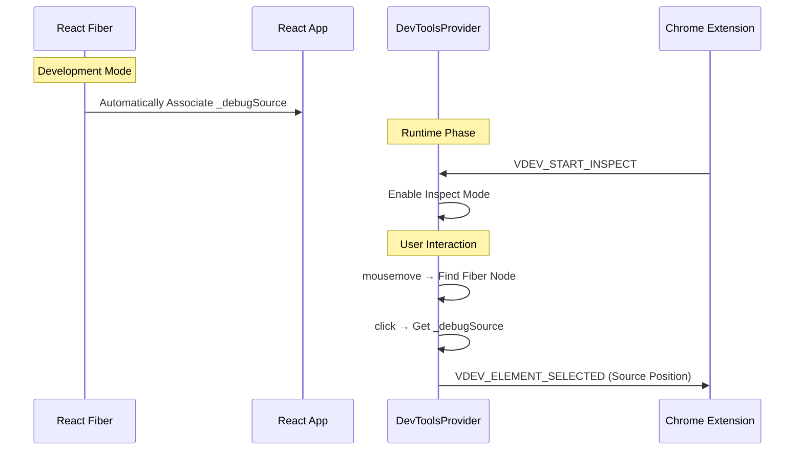
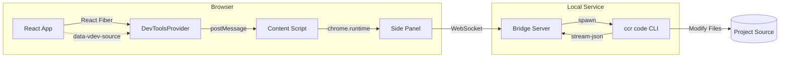
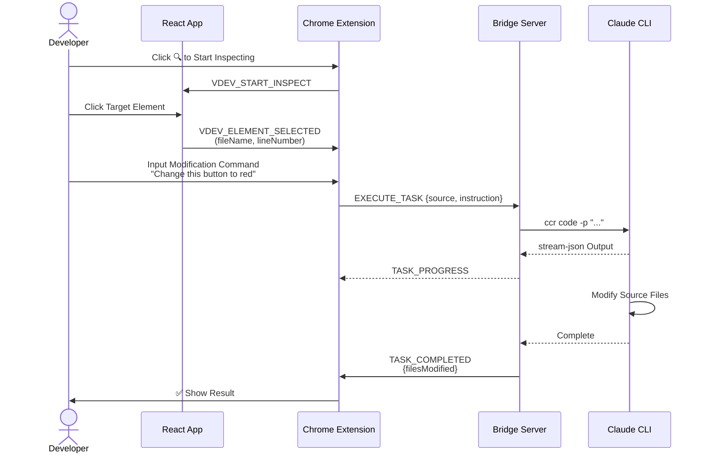

# Visual Agentic Dev - Architecture Design Document

## Overview

Visual Agentic Dev is an **immersive browser development environment** designed to allow developers to complete code modifications, debugging, and command-line interactions **without leaving the browser**.

The core concept seamlesslessly maps local development environment capabilities (Terminal/CLI) to the browser sidebar via a **Bridge Server**. Currently, it not only supports standard terminal operations but also deeply integrates **Claude Code CLI**, enabling a "Click Element -> AI Automatically Modifies Code" closed-loop workflow. Future extensions may support more CLI tools (such as Gemini CLI, OpenCodex CLI, etc.).

---

## System Architecture


```
┌─────────────────────────────────────────────────────────────────────┐
│                         Developer Browser                           │
│  ┌────────────────────────┐    ┌──────────────────────────────────┐ │
│  │     React App A        │    │       Chrome Extension           │ │
│  │  (localhost:3000)      │    │  ┌────────────────────────────┐  │ │
│  │                        │    │  │     Side Panel UI          │  │ │
│  │    React Fiber         │    │  │  ┌─────┐ ┌──────────────┐  │  │ │
│  │    (_debugSource)      │    │  │  │ 🔍  │ │ ProjectTerm A│  │  │ │
│  │                        │    │  │  └──┬──┘ └──────┬───────┘  │  │ │
│  │  └───────────┬────────────┘ │  │     │           │ PTY A    │  │ │
│  │              │              │  │     │    ┌──────┴───────┐  │  │ │
│  │              │              │  │     │    │ ProjectTerm B│  │  │ │
│  │              │              │  │     │    └──────┬───────┘  │  │ │
│  │              │ postMessage  │  │     │           │ PTY B    │  │ │
│  │              └──────────────┼──►     │           │          │  │ │
│  │                             │  └─────┼───────────┼──────────┘  │ │
│  │  ┌────────────────────────┐ │        │           │             │ │
│  │  │     React App B        │ │  ┌─────┴───────────┴──────────┐  │ │
│  │  │  (localhost:3001)      │ │  │     Content Script         │  │ │
│  │  └────────────────────────┘ │  │     (Message Bridge)       │  │ │
│  │                             │  └─────────────┬──────────────┘  │ │
│  └─────────────────────────────┼────────────────┼─────────────────┘ │
│                                │                │
│                                │                │ WebSocket (ws://localhost:9527)
│                                │                ▼
│                   ┌────────────┴────────────────────────────┐
│                   │      Bridge Server (Universal Proxy)    │
│                   │  ┌───────────────────────────────────┐  │
│                   │  │       WebSocket Server            │  │
│                   │  │   (Routes based on projectPath)   │  │
│                   │  └───────────────┬───────────────────┘  │
│                   │                  │                      │
│                   │  ┌───────────────▼───────────────────┐  │
│                   │  │       TerminalManager             │  │
│                   │  │  (Manages PTY Sessions)           │  │
│                   │  └───────────────┬───────────────────┘  │
│                   └──────────────────┼──────────────────────┘
│                                      │
│                                      ▼
│                   ┌──────────────────────────────────────────┐
│                   │            Local System Shell            │
│                   │  ┌──────────────┐      ┌──────────────┐  │
│                   │  │ Claude Code  │      │   Other CLI  │  │
│                   │  │ (Agent Mode) │      │ (Git/Docker) │  │
│                   │  └──────────────┘      └──────────────┘  │
│                   └──────────────────────────────────────────┘
```

---

## Module Design

### 1. React DevTools SDK (`@visual-agentic-dev/react-devtools`)

**Responsibility**: Enable element inspection and source code location within React applications.

```
packages/react-devtools/
├── src/
│   ├── vite-plugin/
│   │   └── jsx-source.ts      # Vite Plugin (Optional, for production or other build environments)
│   ├── babel-plugin/
│   │   └── jsx-source.ts      # Babel Plugin (Optional, for Webpack/Rsbuild)
│   ├── components/
│   │   └── DevToolsProvider.tsx  # Main Component: Check Mode + Event Handling
│   ├── overlay/
│   │   ├── Highlighter.tsx    # Hover Highlighting Overlay
│   │   └── SelectionBox.tsx   # Selection Box + Source Position Display
│   ├── utils/
│   │   ├── messaging.ts       # Communication with Extension
│   │   └── sourceLocator.ts   # Parse Source Position
│   └── types.ts
└── package.json
```

#### Core Flow



---

### 2. Bridge Server (`@visual-agentic-dev/bridge-server`)

**Responsibility**: WebSocket server connecting the browser extension and Claude Code CLI.

```
packages/bridge-server/
├── src/
│   ├── server/
│   │   └── WebSocketServer.ts # WebSocket Service + Message Routing
│   ├── claude/
│   │   ├── ClaudeCodeRunner.ts  # Execute Claude CLI
│   │   └── PromptBuilder.ts     # Build Code Modification Prompts
│   └── types.ts
├── bin/
│   └── vdev-server.js         # CLI Entry Point
└── package.json
```

#### Message Protocol

| Message Type | Direction | Description |
|---------|------|------|
| `EXECUTE_TASK` | Client → Server | Execute code modification task |
| `CANCEL_TASK` | Client → Server | Cancel current task |
| `TASK_STARTED` | Server → Client | Task started |
| `TASK_PROGRESS` | Server → Client | Streaming output progress |
| `TASK_COMPLETED` | Server → Client | Task completed |
| `TERMINAL_DATA` | Client ↔ Server | Terminal input/output stream (must include projectPath) |
| `TERMINAL_RESIZE` | Client → Server | Terminal resize |
| `RESOLVE_PROJECT_PATH` | Client → Server | Resolve project path based on port number |

#### Multi-Project Support

Bridge Server now maintains a `TerminalManager` which manages multiple independent PTY sessions.
- **Session ID**: Generated based on the hash of `projectPath`, ensuring different Tabs of the same project share the same terminal session.
- **Isolation**: Each Session corresponds to an independent Claude Code CLI process, without interference.
- **Dynamic Discovery**: The extension queries the Server for `projectPath` based on the current Tab's port number and automatically switches to the corresponding terminal session.

---

### 3. Chrome Extension (`visual-agentic-dev-extension`)

**Responsibility**: Provide user interface, coordinate communication between SDK and Bridge Server.

```
packages/extension/
├── src/
│   ├── background/
│   │   └── service-worker.ts  # Background Service
│   ├── content/
│   │   └── content-script.ts  # Page Injection Script
│   ├── sidepanel/
│   │   ├── App.tsx            # Main Application
│   │   ├── components/
│   │   │   ├── ChatPanel.tsx  # Chat Panel
│   │   │   ├── ProjectTerminal.tsx # Project-Specific Terminal Component
│   │   │   ├── SourceInfo.tsx     # Source Info Display (Multi-select)
│   │   │   ├── StatusBar.tsx      # Connection Status Bar
│   │   │   ├── Settings.tsx       # Settings Panel
│   │   └── hooks/
│   │       └── useWebSocket.ts    # WebSocket Communication (Multiplexing)
│   └── shared/
│       ├── types.ts
│       └── constants.ts
├── public/
│   ├── manifest.json
│   └── icons/
└── package.json
```

---

## Data Flow



---

## User Flow



---

## Tech Stack

| Module | Technology |
|------|------|
| Build Tool | pnpm workspace + Turbo |
| React SDK | React 18 + TypeScript + tsup |
| Source Location | **React Fiber _debugSource (Runtime)** |
| Compilation Plugin | Vite Plugin / Babel 7 (Alternative) |
| Bridge Server | Node.js + ws |
| Chrome Extension | Vite + React + Manifest V3 |
| AI Backend | Claude Code CLI (ccr proxy) |

---

## Key Design Decisions

### 1. Source Location Strategy
- **Choice**: **Runtime React Fiber Traversal (Preferred)**
- **Reason**: Completely resolves HMR (Hot Module Replacement) instability caused by compile-time plugins interfering with React Fast Refresh.
- **Problems Solved**: 
    - Solved intermittent HMR failures.
    - Solved full page refresh issues caused by exporting non-component objects.
    - Simplified configuration; developers can use it without modifying cumbersome build configurations.
- **Fallback**: Still supports `data-vdev-*` attribute injection to ensure compatibility in non-React or special build environments.

### 2. Communication Architecture
- **SDK ↔ Extension**: `window.postMessage` (Same Page)
- **Extension ↔ Server**: WebSocket (ws://localhost:9527)
- **Reason**: Browser security restrictions require layered communication.

### 3. Claude CLI Integration
- **Command**: `ccr code -p "..." --output-format stream-json`
- **Reason**: Streaming output supports real-time feedback, JSON format is easy to parse.

### 4. Multi-Terminal Architecture
- **Mechanism**: To support developing multiple projects simultaneously, the extension maintains an independent `activeProjects` set in the sidebar for each detected active project.
- **UI**: Uses `<ProjectTerminal />` components, each corresponding to a project path. Non-current project terminals are hidden (via CSS `height: 0` + `overflow: hidden`) to maintain connection and state, but are not visible in the UI.

### 5. Robust Input Clearing Strategy
- **Issue**: Terminal input box may have residual user input before sending a new instruction.
- **Solution**: **Split Command Strategy**
    1. Send `Ctrl+C` (`\x03`): Cancel any currently inputting line or running command.
    2. Wait 50ms: Allow PTY to fully process interrupt signal and flush buffer (prevent Race Condition).
    3. Send new instruction: Ensure instruction is entered on a clean Prompt.
- **Deprecated Solutions**: Using only `Ctrl+U` (may not clear cleanly) or `Ctrl+L` (does not clear input line).

---

## Deployment

1. **Bridge Server**: Run `vdev-server` in local terminal
2. **Chrome Extension**: Load unpacked extension (`chrome://extensions/`)  
3. **React SDK**: npm install into project + Babel config

---

## File Structure Overview

```
visual-agentic-dev/
├── packages/
│   ├── react-devtools/        # React SDK
│   │   ├── src/
│   │   ├── package.json
│   │   └── tsup.config.ts
│   ├── bridge-server/         # Local Server
│   │   ├── src/
│   │   ├── bin/
│   │   ├── package.json
│   │   └── tsup.config.ts
│   ├── extension/             # Chrome Extension
│   │   ├── src/
│   │   ├── public/
│   │   ├── package.json
│   │   └── vite.config.ts
├── pnpm-workspace.yaml
├── turbo.json
├── tsconfig.base.json
├── package.json
└── README.md
```
