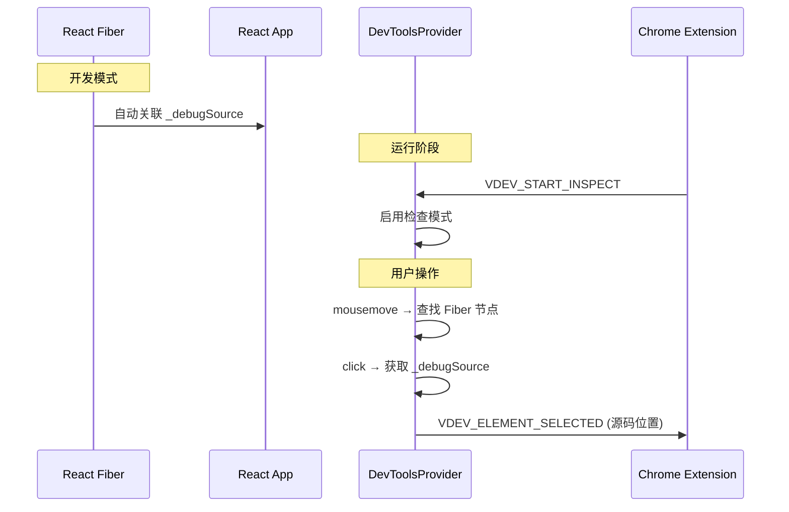
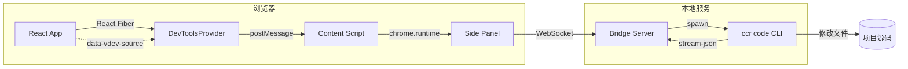
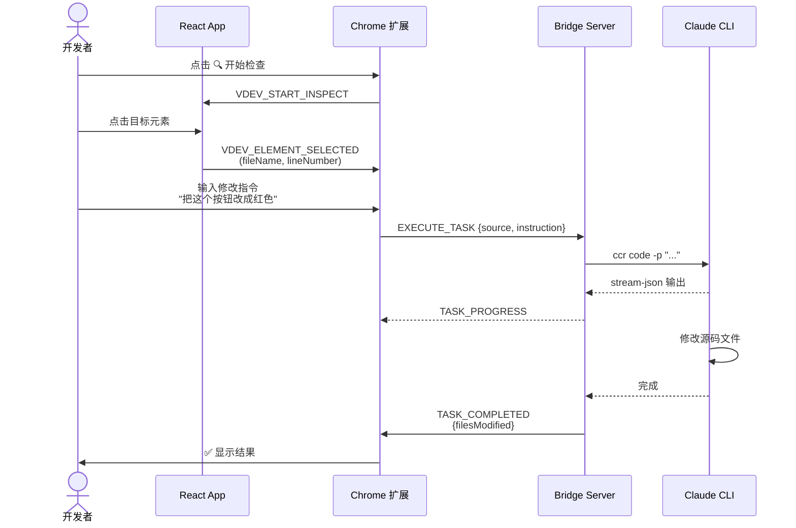

# Visual Dev Tool - 架构设计文档

## 概述

Visual Dev Tool 是一个**沉浸式浏览器开发环境**，旨在让开发者**不脱离浏览器**即可完成代码修改、调试和命令行交互。

核心理念通过 **Bridge Server** 将本地开发环境（Terminal/CLI）的能力无缝映射到浏览器侧边栏。目前不仅支持标准的终端操作，还深度集成了 **Claude Code CLI**，实现了"点击元素 -> AI 自动修改代码"闭环工作流。未来可扩展支持更多 CLI 工具（如 Gemini CLI, OpenCodex CLI等）。

---

## 系统架构


```
┌─────────────────────────────────────────────────────────────────────┐
│                         Developer Browser                           │
│  ┌────────────────────────┐    ┌──────────────────────────────────┐ │
│  │     React App A        │    │       Chrome Extension           │ │
│  │  (localhost:3000)      │    │  ┌────────────────────────────┐  │ │
│  │                        │    │  │     Side Panel UI          │  │ │
│  │    React Fiber         │    │  │  ┌─────┐ ┌──────────────┐  │  │ │
│  │    (_debugSource)      │    │  │  │ 🔍  │ │ ProjectTerm A│  │  │ │
│  │                        │    │  │  └──┬──┘ └──────┬───────┘  │  │ │
│  └───────────┬────────────┘    │  │     │           │ PTY A    │  │ │
│              │                 │  │     │    ┌──────┴───────┐  │  │ │
│              │                 │  │     │    │ ProjectTerm B│  │  │ │
│              │                 │  │     │    └──────┬───────┘  │  │ │
│              │ postMessage     │  │     │           │ PTY B    │  │ │
│              └─────────────────┼──►     │           │          │  │ │
│                                │  └─────┼───────────┼──────────┘  │ │
│  ┌────────────────────────┐    │        │           │             │ │
│  │     React App B        │    │  ┌─────┴───────────┴──────────┐  │ │
│  │  (localhost:3001)      │    │  │     Content Script         │  │ │
│  └────────────────────────┘    │  │     (Message Bridge)       │  │ │
│                                │  └─────────────┬──────────────┘  │ │
└────────────────────────────────┼────────────────┼─────────────────┘
                                 │                │
                                 │                │ WebSocket (ws://localhost:9527)
                                 │                ▼
                    ┌────────────┴────────────────────────────┐
                    │      Bridge Server (Universal Proxy)    │
                    │  ┌───────────────────────────────────┐  │
                    │  │       WebSocket Server            │  │
                    │  │   (Routes based on projectPath)   │  │
                    │  └───────────────┬───────────────────┘  │
                    │                  │                      │
                    │  ┌───────────────▼───────────────────┐  │
                    │  │       TerminalManager             │  │
                    │  │  (Manages PTY Sessions)           │  │
                    │  └───────────────┬───────────────────┘  │
                    └──────────────────┼──────────────────────┘
                                       │
                                       ▼
                    ┌──────────────────────────────────────────┐
                    │            Local System Shell            │
                    │  ┌──────────────┐      ┌──────────────┐  │
                    │  │ Claude Code  │      │   Other CLI  │  │
                    │  │ (Agent Mode) │      │ (Git/Docker) │  │
                    │  └──────────────┘      └──────────────┘  │
                    └──────────────────────────────────────────┘
```

---

## 模块设计

### 1. React DevTools SDK (`@visual-dev/react-devtools`)

**职责**: 在 React 应用中启用元素检查和源码定位

```
packages/react-devtools/
├── src/
│   ├── vite-plugin/
│   │   └── jsx-source.ts      # Vite 插件 (可选，用于生产或其他构建环境)
│   ├── babel-plugin/
│   │   └── jsx-source.ts      # Babel 插件 (可选，用于 Webpack/Rsbuild)
│   ├── components/
│   │   └── DevToolsProvider.tsx  # 主组件：检查模式 + 事件处理
│   ├── overlay/
│   │   ├── Highlighter.tsx    # 悬停高亮覆盖层
│   │   └── SelectionBox.tsx   # 选中框 + 源码位置显示
│   ├── utils/
│   │   ├── messaging.ts       # 与扩展通信
│   │   └── sourceLocator.ts   # 解析源码位置
│   └── types.ts
└── package.json
```

#### 核心流程



---

### 2. Bridge Server (`@visual-dev/bridge-server`)

**职责**: WebSocket 服务器，连接浏览器扩展与 Claude Code CLI

```
packages/bridge-server/
├── src/
│   ├── server/
│   │   └── WebSocketServer.ts # WebSocket 服务 + 消息路由
│   ├── claude/
│   │   ├── ClaudeCodeRunner.ts  # 执行 Claude CLI
│   │   └── PromptBuilder.ts     # 构建代码修改提示词
│   └── types.ts
├── bin/
│   └── vdev-server.js         # CLI 入口
└── package.json
```

#### 消息协议

| 消息类型 | 方向 | 说明 |
|---------|------|------|
| `EXECUTE_TASK` | Client → Server | 执行代码修改任务 |
| `CANCEL_TASK` | Client → Server | 取消当前任务 |
| `TASK_STARTED` | Server → Client | 任务开始 |
| `TASK_PROGRESS` | Server → Client | 流式输出进度 |
| `TASK_COMPLETED` | Server → Client | 任务完成 |
| `TERMINAL_DATA` | Client ↔ Server | 终端输入/输出流 (需带 projectPath) |
| `TERMINAL_RESIZE` | Client → Server | 终端调整大小 |
| `RESOLVE_PROJECT_PATH` | Client → Server | 根据端口号解析项目路径 |

#### 多项目支持 (Multi-Project Support)

Bridge Server 现在维护一个 `TerminalManager`，它管理着多个独立的 PTY 会话 (Session)。
- **Session ID**: 基于 `projectPath` 的哈希值生成，确保同一项目的不同 Tab 共享同一个终端会话。
- **隔离性**: 每个 Session 对应一个独立的 Claude Code CLI 进程，互不干扰。
- **动态发现**: 扩展根据当前 Tab 的端口号向 Server 查询 `projectPath`，自动切换到对应的终端会话。

---

### 3. Chrome Extension (`visual-dev-extension`)

**职责**: 提供用户界面，协调 SDK 与 Bridge Server 通信

```
packages/extension/
├── src/
│   ├── background/
│   │   └── service-worker.ts  # 后台服务
│   ├── content/
│   │   └── content-script.ts  # 页面注入脚本
│   ├── sidepanel/
│   │   ├── App.tsx            # 主应用
│   │   ├── components/
│   │   │   ├── ChatPanel.tsx  # 聊天面板
│   │   │   ├── ProjectTerminal.tsx # 项目专属终端组件
│   │   │   ├── SourceInfo.tsx     # 源码信息显示 (支持多选)
│   │   │   ├── StatusBar.tsx      # 连接状态栏
│   │   │   └── Settings.tsx       # 设置面板
│   │   └── hooks/
│   │       └── useWebSocket.ts    # WebSocket 通信 (支持多路复用)
│   └── shared/
│       ├── types.ts
│       └── constants.ts
├── public/
│   ├── manifest.json
│   └── icons/
└── package.json
```

---

## 数据流



---

## 使用流程



---

## 技术栈

| 模块 | 技术 |
|------|------|
| 构建工具 | pnpm workspace + Turbo |
| React SDK | React 18 + TypeScript + tsup |
| 源码定位 | **React Fiber _debugSource (运行时)** |
| 编译插件 | Vite 插件 / Babel 7 (备选) |
| Bridge Server | Node.js + ws |
| Chrome Extension | Vite + React + Manifest V3 |
| AI 后端 | Claude Code CLI (ccr 代理) |

---

## 关键设计决策

### 1. 源码定位方式
- **选择**: **运行时 React Fiber 遍历 (首选)**
- **原因**: 彻底解决编译时插件干扰 React Fast Refresh 导致的 HMR 不稳定问题。
- **解决的问题**: 
    - 解决了 HMR (热更新) 间歇性失效的问题。
    - 解决了由于导出非组件对象导致的页面全量刷新问题。
    - 简化了配置，开发者无需修改繁琐的构建配置即可使用。
- **回退方案**: 依然支持 `data-vdev-*` 属性注入，以保证在非 React 或特殊构建环境下的兼容性。

### 2. 通信架构
- **SDK ↔ Extension**: `window.postMessage` (同页面)
- **Extension ↔ Server**: WebSocket (ws://localhost:9527)
- **原因**: 浏览器安全限制，需要分层通信

### 3. Claude CLI 集成
- **命令**: `ccr code -p "..." --output-format stream-json`
- **原因**: 流式输出支持实时反馈，JSON 格式便于解析

### 4. 多终端架构 (Multi-Terminal)
- **机制**: 为了支持同时开发多个项目，扩展会在侧边栏中为每个检测到的活动项目维护一个独立的 `activeProjects` 集合。
- **UI**: 使用 `<ProjectTerminal />` 组件，每个组件对应一个项目路径。非当前项目的终端会被隐藏 (通过 CSS `height: 0` + `overflow: hidden`) 以保持连接和状态，但在 UI 上不可见。

### 5. 终端输入清洗策略 (Robust Input Clearing)
- **问题**: 在发送新指令前，终端输入框可能残留有用户之前的输入。
- **解决方案**: **Split Command Strategy**
    1. 发送 `Ctrl+C` (`\x03`)：取消当前可能正在输入的行或运行的命令。
    2. 等待 50ms：让 PTY 充分处理中断信号和刷新缓冲区 (防止 Race Condition)。
    3. 发送新指令：确保指令是在一个干净的 Prompt 上输入的。
- **弃用方案**: 仅使用 `Ctrl+U` (可能清除不干净) 或 `Ctrl+L` (不清空输入行)。

---

## 部署方式

1. **Bridge Server**: 本地终端运行 `vdev-server`
2. **Chrome Extension**: 加载未打包扩展 (`chrome://extensions/`)  
3. **React SDK**: npm 安装到项目 + Babel 配置

---

## 文件结构总览

```
visual-dev-tool/
├── packages/
│   ├── react-devtools/        # React SDK
│   │   ├── src/
│   │   ├── package.json
│   │   └── tsup.config.ts
│   ├── bridge-server/         # 本地服务器
│   │   ├── src/
│   │   ├── bin/
│   │   ├── package.json
│   │   └── tsup.config.ts
│   └── extension/             # Chrome 扩展
│       ├── src/
│       ├── public/
│       ├── package.json
│       └── vite.config.ts
├── pnpm-workspace.yaml
├── turbo.json
├── tsconfig.base.json
├── package.json
└── README.md
```
