# Visual Dev Tool - 架构设计文档

## 概述

Visual Dev Tool 是一个可视化开发工具，允许开发者在浏览器中点击 React 元素，通过 Chrome 扩展侧边栏对话描述需求，由 Claude Code CLI 自动执行代码修改。

---

## 系统架构

```
┌─────────────────────────────────────────────────────────────────────┐
│                         Developer Browser                           │
│  ┌────────────────────────┐    ┌──────────────────────────────────┐ │
│  │     React App          │    │       Chrome Extension           │ │
│  │  ┌──────────────────┐  │    │  ┌────────────────────────────┐  │ │
│  │  │ DevToolsProvider │  │    │  │     Side Panel UI          │  │ │
│  │  │   + Overlays     │  │    │  │  ┌─────┐ ┌──────────────┐  │  │ │
│  │  └────────┬─────────┘  │    │  │  │ 🔍  │ │  Chat Panel  │  │  │ │
│  │           │            │    │  │  └──┬──┘ └──────┬───────┘  │  │ │
│  │    React Fiber         │    │  │     │          │           │  │ │
│  │    (_debugSource)      │    │  └─────┼──────────┼───────────┘  │ │
│  └───────────┬────────────┘    │        │          │              │ │
│              │                 │  ┌─────┴──────────┴───────────┐  │ │
│              │ postMessage     │  │     Content Script         │  │ │
│              └─────────────────┼──►     (Message Bridge)       │  │ │
│                                │  └─────────────┬──────────────┘  │ │
└────────────────────────────────┼────────────────┼─────────────────┘
                                 │                │
                                 │                │ WebSocket
                                 │                ▼
                    ┌────────────┴────────────────────────────┐
                    │          Bridge Server (localhost)       │
                    │  ┌───────────────────────────────────┐   │
                    │  │       WebSocket Server (:9527)    │   │
                    │  └───────────────┬───────────────────┘   │
                    │                  │                       │
                    │  ┌───────────────▼───────────────────┐   │
                    │  │       ClaudeCodeRunner            │   │
                    │  │  ccr code -p "..." --output-format │   │
                    │  │       stream-json                 │   │
                    │  └───────────────┬───────────────────┘   │
                    └──────────────────┼───────────────────────┘
                                       │
                                       ▼
                    ┌──────────────────────────────────────────┐
                    │            Claude Code CLI               │
                    │        (修改项目源代码文件)               │
                    └──────────────────────────────────────────┘
```

---

## 模块设计

### 1. React DevTools SDK (`@visual-dev/react-devtools`)

**职责**: 在 React 应用中启用元素检查和源码定位

```
packages/react-devtools/
├── src/
│   ├── vite-plugin/
│   │   └── jsx-source.ts      # Vite 插件 (可选，用于生产或其他构建环境)
│   ├── babel-plugin/
│   │   └── jsx-source.ts      # Babel 插件 (可选，用于 Webpack/Rsbuild)
│   ├── components/
│   │   └── DevToolsProvider.tsx  # 主组件：检查模式 + 事件处理
│   ├── overlay/
│   │   ├── Highlighter.tsx    # 悬停高亮覆盖层
│   │   └── SelectionBox.tsx   # 选中框 + 源码位置显示
│   ├── utils/
│   │   ├── messaging.ts       # 与扩展通信
│   │   └── sourceLocator.ts   # 解析源码位置
│   └── types.ts
└── package.json
```

#### 核心流程

```mermaid
sequenceDiagram
    participant Fiber as React Fiber
    participant App as React App
    participant Provider as DevToolsProvider
    participant Ext as Chrome Extension

    Note over Fiber: 开发模式
    Fiber->>App: 自动关联 _debugSource

    Note over Provider: 运行阶段
    Ext->>Provider: VDEV_START_INSPECT
    Provider->>Provider: 启用检查模式
    
    Note over Provider: 用户操作
    Provider->>Provider: mousemove → 查找 Fiber 节点
    Provider->>Provider: click → 获取 _debugSource
    Provider->>Ext: VDEV_ELEMENT_SELECTED (源码位置)
```



---

### 2. Bridge Server (`@visual-dev/bridge-server`)

**职责**: WebSocket 服务器，连接浏览器扩展与 Claude Code CLI

```
packages/bridge-server/
├── src/
│   ├── server/
│   │   └── WebSocketServer.ts # WebSocket 服务 + 消息路由
│   ├── claude/
│   │   ├── ClaudeCodeRunner.ts  # 执行 Claude CLI
│   │   └── PromptBuilder.ts     # 构建代码修改提示词
│   └── types.ts
├── bin/
│   └── vdev-server.js         # CLI 入口
└── package.json
```

#### 消息协议

| 消息类型 | 方向 | 说明 |
|---------|------|------|
| `EXECUTE_TASK` | Client → Server | 执行代码修改任务 |
| `CANCEL_TASK` | Client → Server | 取消当前任务 |
| `TASK_STARTED` | Server → Client | 任务开始 |
| `TASK_PROGRESS` | Server → Client | 流式输出进度 |
| `TASK_COMPLETED` | Server → Client | 任务完成 |
| `TASK_ERROR` | Server → Client | 任务出错 |

---

### 3. Chrome Extension (`visual-dev-extension`)

**职责**: 提供用户界面，协调 SDK 与 Bridge Server 通信

```
packages/extension/
├── src/
│   ├── background/
│   │   └── service-worker.ts  # 后台服务
│   ├── content/
│   │   └── content-script.ts  # 页面注入脚本
│   ├── sidepanel/
│   │   ├── App.tsx            # 主应用
│   │   ├── components/
│   │   │   ├── ChatPanel.tsx  # 聊天面板
│   │   │   ├── SourceInfo.tsx # 源码信息显示
│   │   │   ├── StatusBar.tsx  # 连接状态栏
│   │   │   └── Settings.tsx   # 设置面板
│   │   └── hooks/
│   │       └── useWebSocket.ts # WebSocket 通信
│   └── shared/
│       ├── types.ts
│       └── constants.ts
├── public/
│   ├── manifest.json
│   └── icons/
└── package.json
```

---

## 数据流

```mermaid
flowchart LR
    subgraph Browser["浏览器"]
        A[React App] -->|React Fiber| B[DevToolsProvider]
        A -.->|data-vdev-source| B
        B -->|postMessage| C[Content Script]
        C -->|chrome.runtime| D[Side Panel]
    end
    
    subgraph Server["本地服务"]
        D -->|WebSocket| E[Bridge Server]
        E -->|spawn| F[ccr code CLI]
        F -->|stream-json| E
    end
    
    F -->|修改文件| G[(项目源码)]
```



---

## 使用流程

```mermaid
sequenceDiagram
    actor Dev as 开发者
    participant App as React App
    participant Ext as Chrome 扩展
    participant Bridge as Bridge Server
    participant CLI as Claude CLI

    Dev->>Ext: 点击 🔍 开始检查
    Ext->>App: VDEV_START_INSPECT
    
    Dev->>App: 点击目标元素
    App->>Ext: VDEV_ELEMENT_SELECTED<br/>(fileName, lineNumber)
    
    Dev->>Ext: 输入修改指令<br/>"把这个按钮改成红色"
    Ext->>Bridge: EXECUTE_TASK {source, instruction}
    
    Bridge->>CLI: ccr code -p "..."
    CLI-->>Bridge: stream-json 输出
    Bridge-->>Ext: TASK_PROGRESS
    
    CLI->>CLI: 修改源码文件
    CLI-->>Bridge: 完成
    Bridge->>Ext: TASK_COMPLETED<br/>{filesModified}
    
    Ext->>Dev: ✅ 显示结果
```



---

## 技术栈

| 模块 | 技术 |
|------|------|
| 构建工具 | pnpm workspace + Turbo |
| React SDK | React 18 + TypeScript + tsup |
| 源码定位 | **React Fiber _debugSource (运行时)** |
| 编译插件 | Vite 插件 / Babel 7 (备选) |
| Bridge Server | Node.js + ws |
| Chrome Extension | Vite + React + Manifest V3 |
| AI 后端 | Claude Code CLI (ccr 代理) |

---

## 关键设计决策

### 1. 源码定位方式
- **选择**: **运行时 React Fiber 遍历 (首选)**
- **原因**: 彻底解决编译时插件干扰 React Fast Refresh 导致的 HMR 不稳定问题。
- **解决的问题**: 
    - 解决了 HMR (热更新) 间歇性失效的问题。
    - 解决了由于导出非组件对象导致的页面全量刷新问题。
    - 简化了配置，开发者无需修改繁琐的构建配置即可使用。
- **回退方案**: 依然支持 `data-vdev-*` 属性注入，以保证在非 React 或特殊构建环境下的兼容性。

### 2. 通信架构
- **SDK ↔ Extension**: `window.postMessage` (同页面)
- **Extension ↔ Server**: WebSocket (ws://localhost:9527)
- **原因**: 浏览器安全限制，需要分层通信

### 3. Claude CLI 集成
- **命令**: `ccr code -p "..." --output-format stream-json`
- **原因**: 流式输出支持实时反馈，JSON 格式便于解析

---

## 部署方式

1. **Bridge Server**: 本地终端运行 `vdev-server`
2. **Chrome Extension**: 加载未打包扩展 (`chrome://extensions/`)  
3. **React SDK**: npm 安装到项目 + Babel 配置

---

## 文件结构总览

```
visual-dev-tool/
├── packages/
│   ├── react-devtools/        # React SDK
│   │   ├── src/
│   │   ├── package.json
│   │   └── tsup.config.ts
│   ├── bridge-server/         # 本地服务器
│   │   ├── src/
│   │   ├── bin/
│   │   ├── package.json
│   │   └── tsup.config.ts
│   └── extension/             # Chrome 扩展
│       ├── src/
│       ├── public/
│       ├── package.json
│       └── vite.config.ts
├── pnpm-workspace.yaml
├── turbo.json
├── tsconfig.base.json
├── package.json
└── README.md
```
